@[toc] 

# System Sequence Diagrams 功能模型

## 商家注册 
--- 
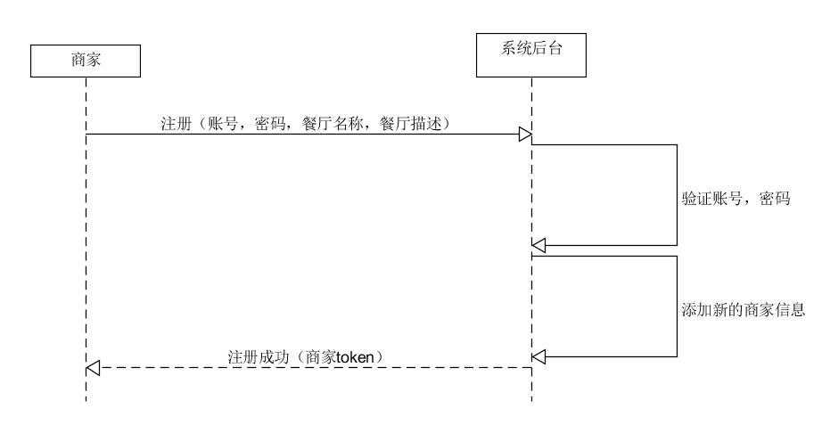  

## 商家登录
---
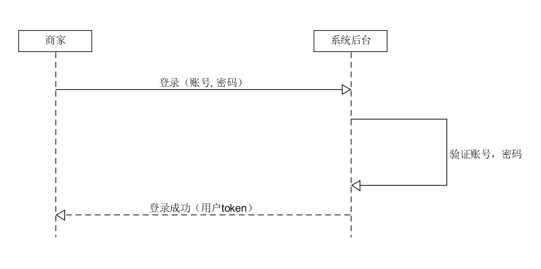  

## 餐厅信息设置
---
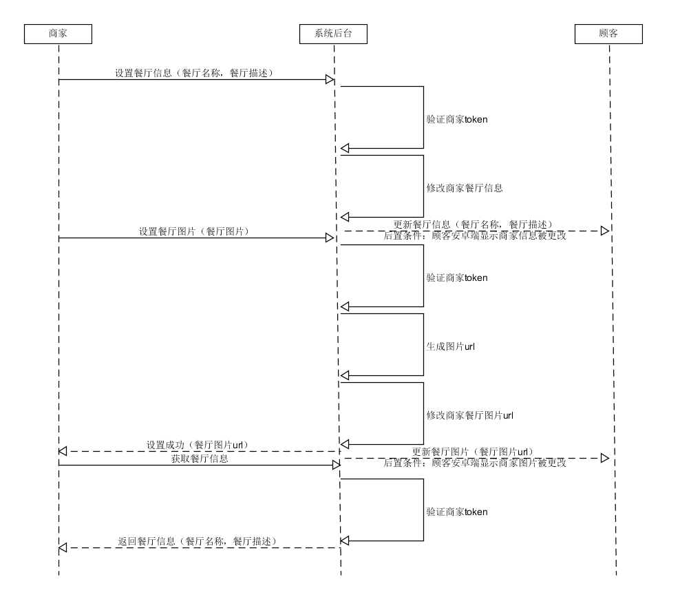  

## 二维码生成
---
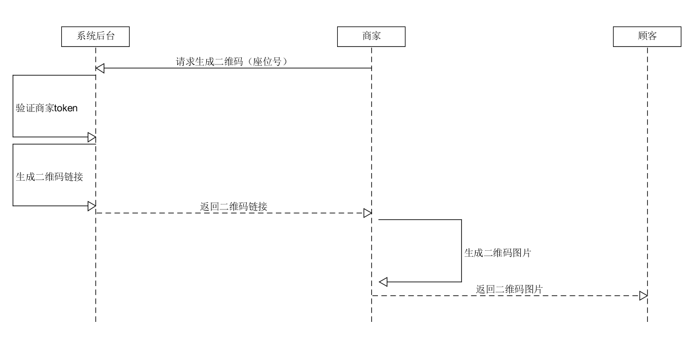  

## 扫码点餐
---
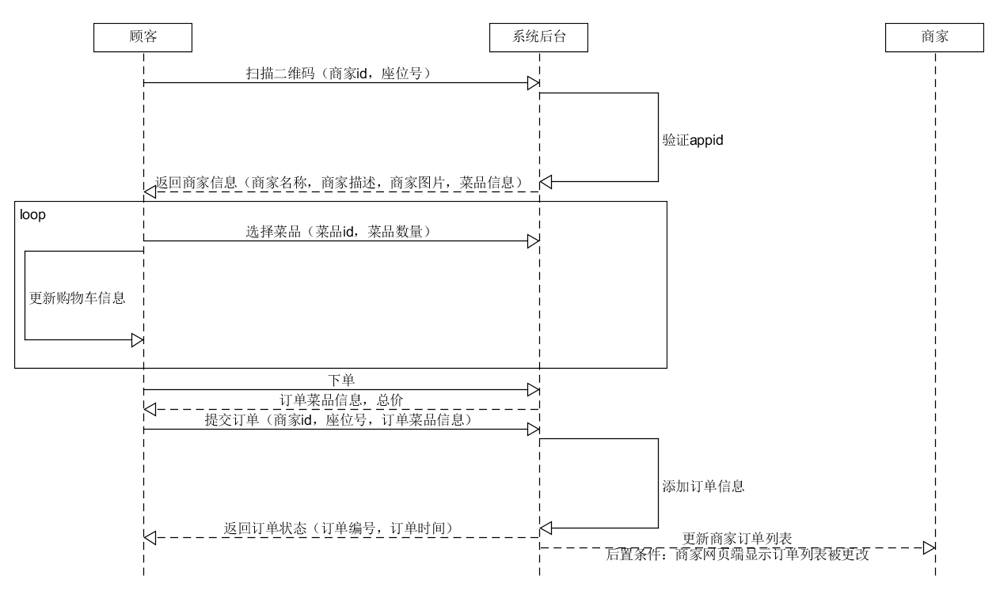  

## 商家管理菜品分类
---
### 添加菜品分类
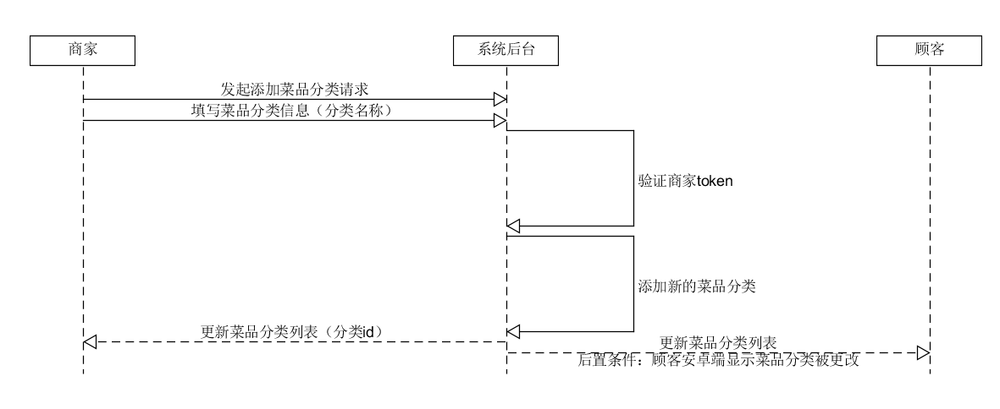  

### 删除菜品分类
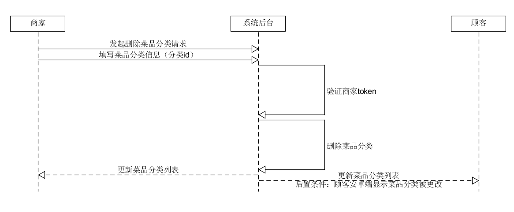  

### 获取菜品分类列表
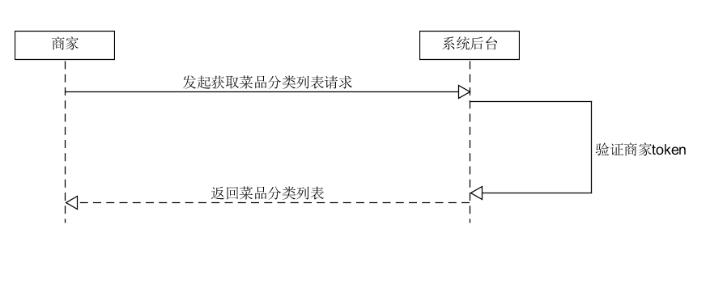  

## 商家管理菜品
---
### 添加菜品
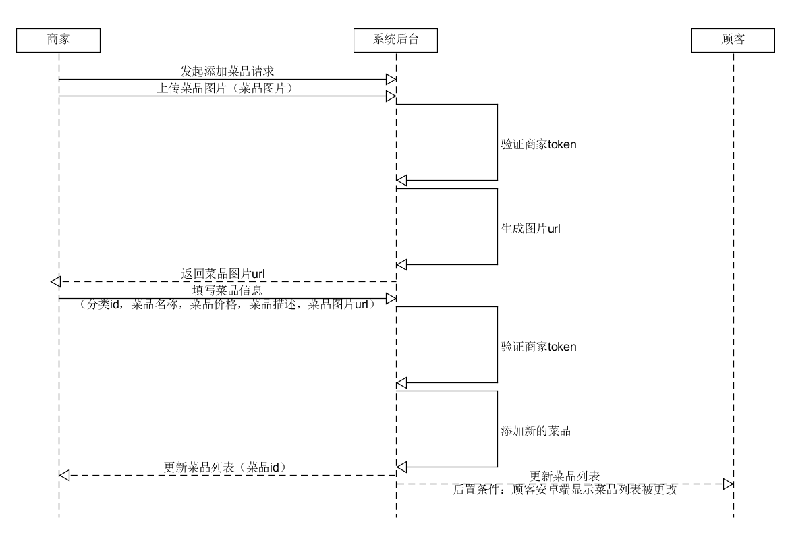  

### 修改菜品
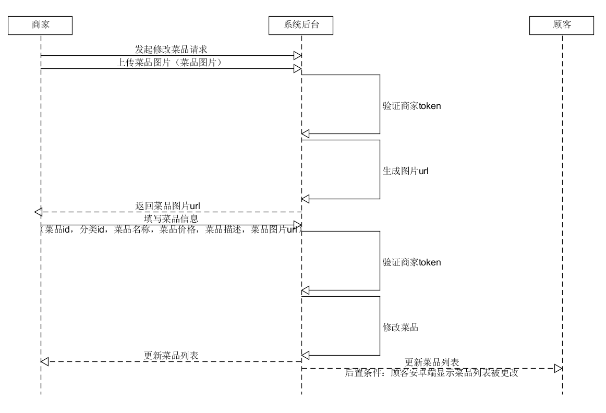  

### 删除菜品
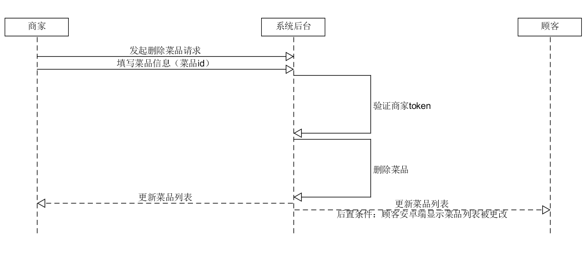  

### 获取菜品列表
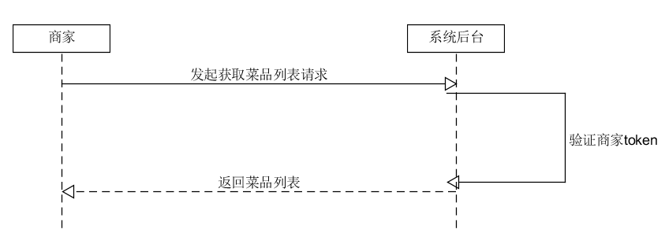  

## 商家管理订单
---
### 修改订单状态
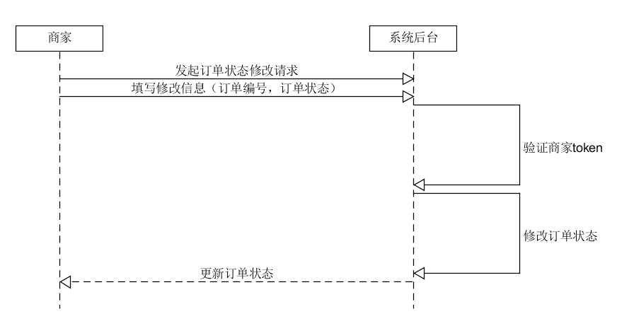  

### 获取订单列表
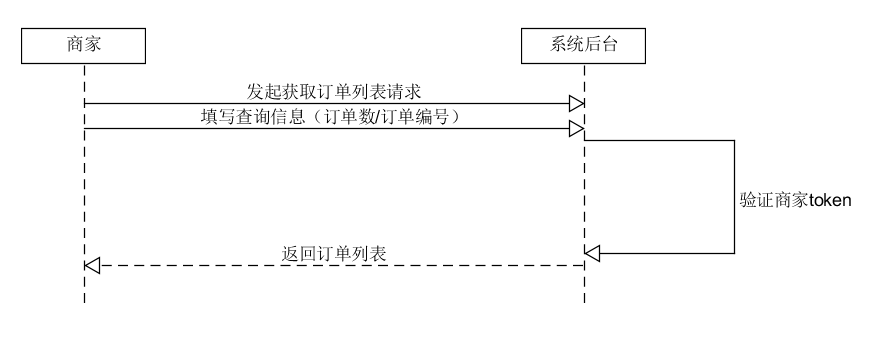  

### 获取订单详情
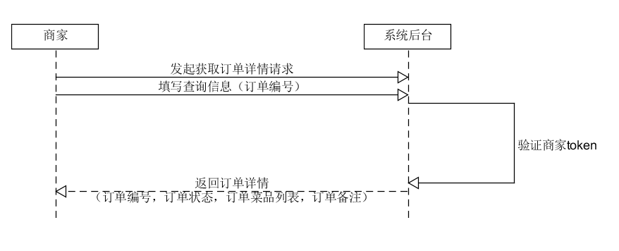  
