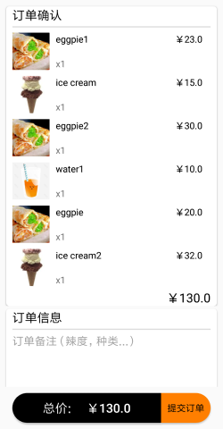

# Android UI Design

---

### **界面组成** ###
 - 扫码页面(首页面)
 - 主菜单界面
 - 商店详情界面
 - 菜品详情界面
 - 订单确认界面
 - 订单信息界面
 
#### **扫码页面** ####

- 最上方是标题。  
- 页面中央是扫码图标，点击扫码图标开始扫码。  
- 扫码成功将跳转到点餐界面。  

#### **主菜单界面** ####

主菜单界面包括商家简介，菜品列表以及订单按钮。

- 点击商家信息（图片，名字，简介）可以跳转到商家详情界面。

- 菜单列表顶部的标题栏显示当前列表第一个item的种类，与左边的种类列表互相关联。点击左边的菜品种类，右边的菜品列表会跳转到相应的种类；滑动右边的菜品列表，左边的菜品种类会相应地切换。可以点击按钮添加菜品到订单或者从订单中删除菜品，点击菜品列表中的项目会跳转到菜品详情界面。

- 底部的订单按钮分为两部分，左部分显示当前订单总价，当订单列表中有菜品项时，点击可以查看订单。  
  右部分当订单列表中有菜品项时按下可以跳转到订单确认界面。

#### **商店详情界面** ####

商店详情界面包括商家图片，商家名称和商家简介。

#### **菜品详情界面** ####

菜品详情界面包括菜品图片，菜品名称和菜品简介。  
点击按钮可以添加菜品到订单或者从订单中删除菜品。  
底部的订单按钮与主菜单界面逻辑相同。

#### **订单确认界面** ####

订单确认界面包含订单列表、备注和订单确认按钮，使用CardView进行美化。  
订单列表列出选择的菜品，包括每种菜的数量和总价。列表高度根据菜品数量自适应   
备注包含标题和可以输入的文本框，用户可以输入备注。  
订单确认按钮左边为订单总价，右边为确认按钮，点击跳转至订单详情界面。
 

#### **订单信息界面** ####

订单信息界面与订单确认界面的设计大致相同，增加了订单信息显示订单号和订单时间。

