<h1>Web Client UI Design</h1>

---

<h2>界面设计目的</h2>

建立简单、一致、高效、易用、友好的用户使用体验。

<h2>界面设计原则</h2>

- 简易性。设计简洁的界面，令用户便于了解并使用产品，减少用户发生错误操作的可能性。

- 一致性。界面的结构、风格需要保持一致。具体到图标的大小、颜色，字体的类型和大小等。

- 从用户习惯考虑。从用户的角度出发，想用户所想，做用户所做。界面应当符合一般用户的使用习惯。

- 导航明确。导航放置在明确的位置，确保用户在使用不同功能的时候不会迷路，清楚自己正在使用哪个功能，并知道其他功能如何跳转、使用。

- 流程清晰。避免出现用户目标流程之外的内容打断流程，并给予适当的使用引导令用户成功完成整套流程。

- 操作反馈适当。在用户进行操作后，给予适当的操作反馈，强化用户的操作感、减轻记忆负担。

<h2>界面组成</h2>

- [登录界面](#1)
- [注册界面](#2)
- [商品分类界面](#3)
- [商品界面](#4)
- [店铺信息界面](#5)
- [收入统计界面](#6)
- [二维码管理界面](#7)
- [店铺信息编辑界面](#8)
- [订单界面](#9)
 
<h3 id='1'>登录界面</h3>

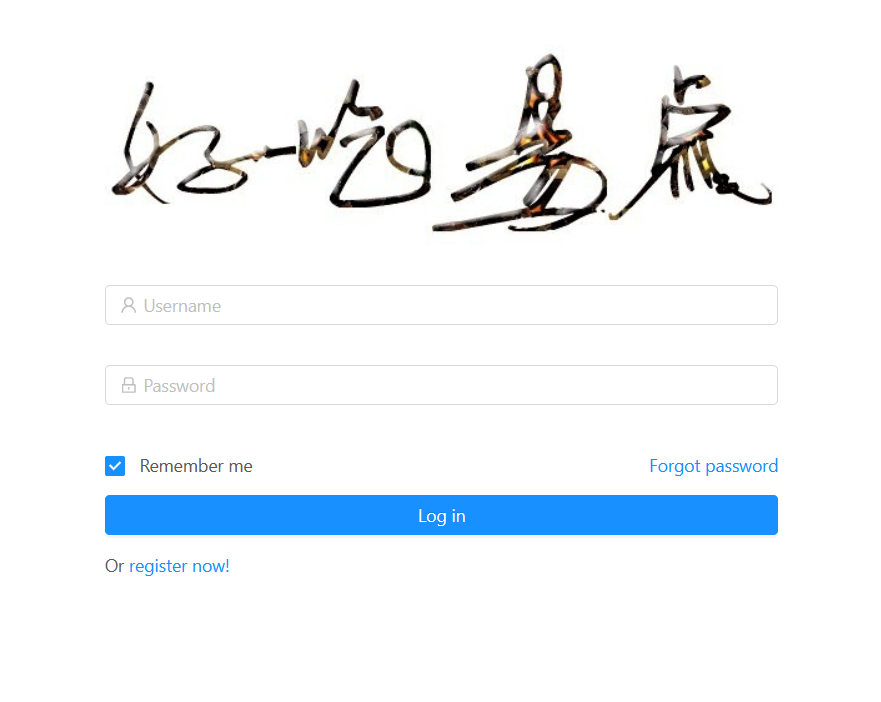
此界面为默认界面。用于给未登录的用户登录，以使用其他功能。已有账号时，输入用户名和密码，点击“Log in”按钮登录，登录后会跳转到商品分类界面。没有账号时，点击下方的“register now”按钮，跳转到注册界面，进行账号的注册。

<h3 id='2'>注册界面</h3>

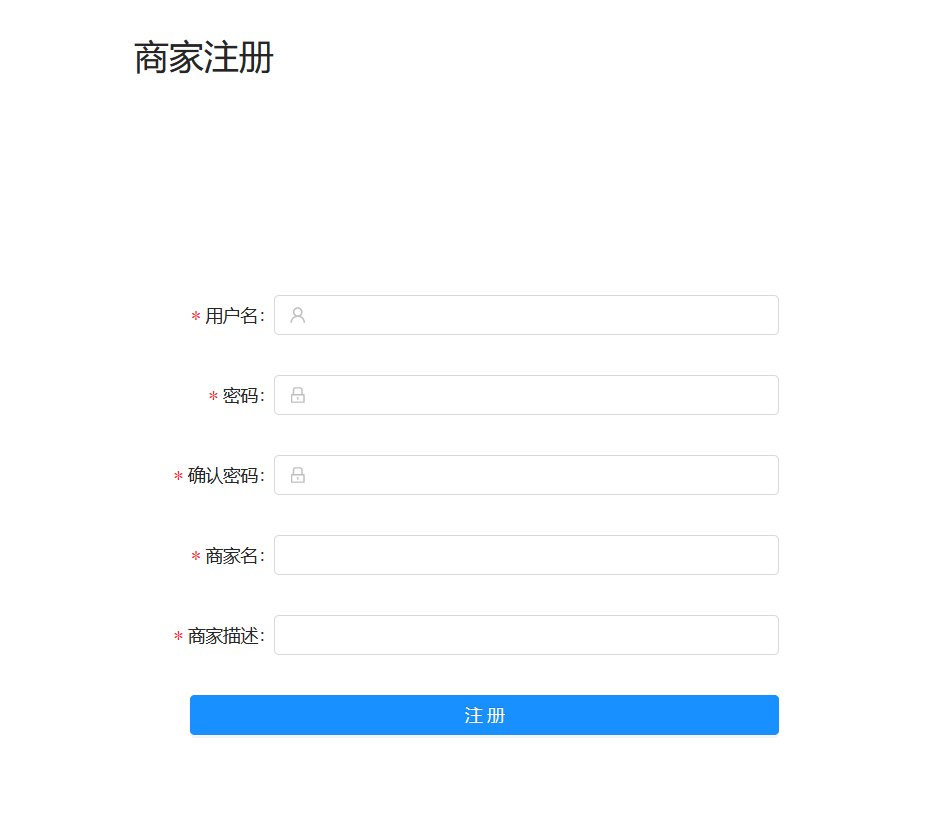
此界面从登录界面跳转进入。用于给用户注册新账号。输入欲注册的账号的用户名、密码、商家名称和商家描述，点击“注册”按钮，进行账号的注册。

<h3 id='3'>商品分类界面</h3>

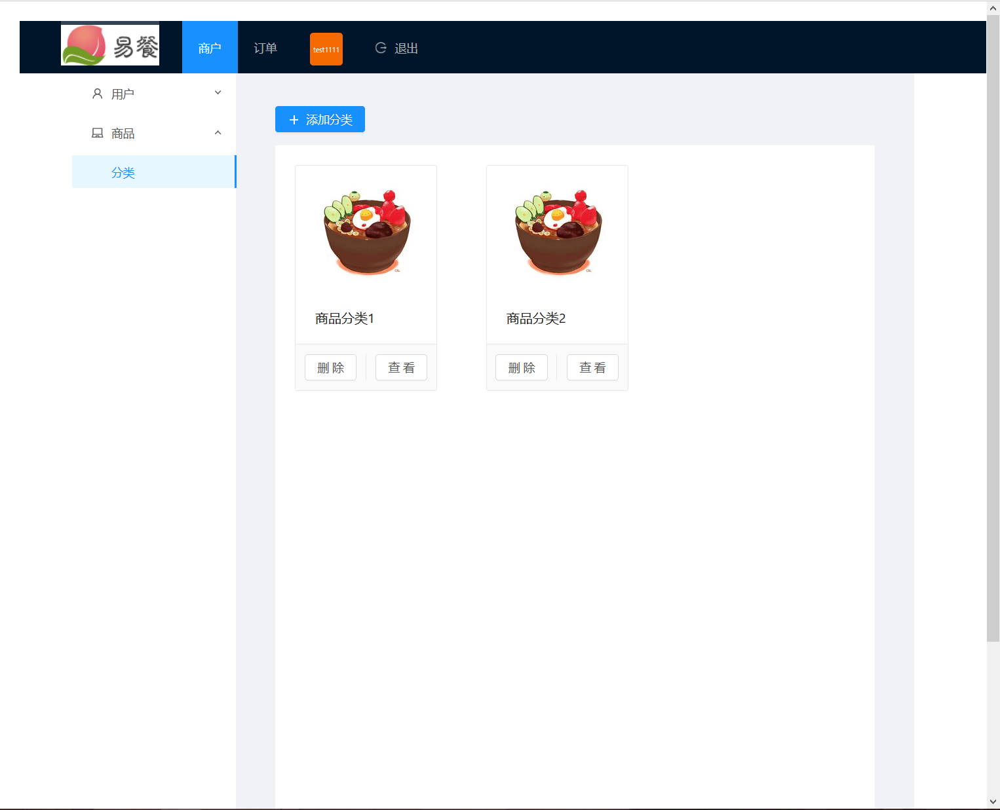
此界面为用户登录后的默认界面，或者通过登录后，点击左侧导航栏的“商品”分类下的“分类”按钮进入。用于显示商家拥有的商品分类，并提供查看分类、添加分类、删除分类功能。点击其中某个分类上的“查看”按钮，会跳转到该分类的商品界面。点击其中某个分类的“删除”按钮，会将该分类删除。点击上方的“添加分类”按钮，会在右侧弹出如下图所示的添加商品分类子界面。

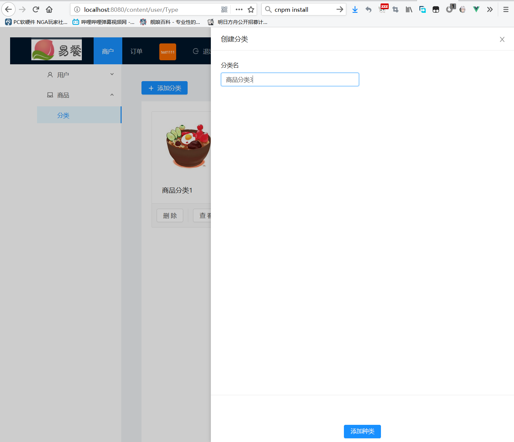
在添加商品分类子界面中，输入想添加的商品分类名称，点击“添加种类”按钮，会添加该新的商品分类。若不想添加了，点击右上的X型按钮返回。

<h3 id='4'>商品界面</h3>

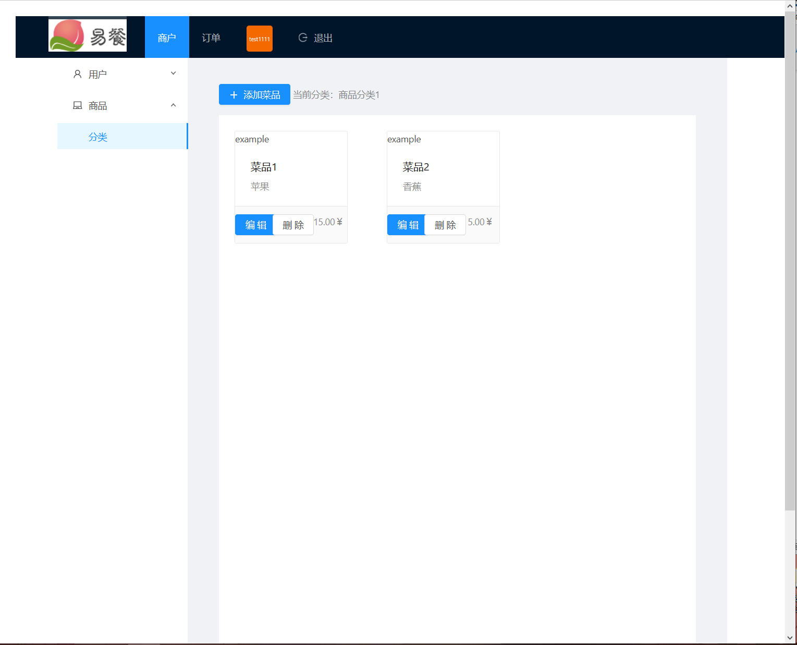
此界面通过在商品分类界面中点击某个分类上的“查看”按钮进入。用于显示该分类中的商品，并提供添加商品、删除商品、编辑商品功能。点击其中某个商品上的“删除”按钮，会把该商品从此分类中删除。点击其中某个商品上的“编辑”按钮，会弹出如下图所示的商品信息编辑子界面。点击上方的“添加菜品按钮”，会弹出如下下图所示的添加商品子界面。

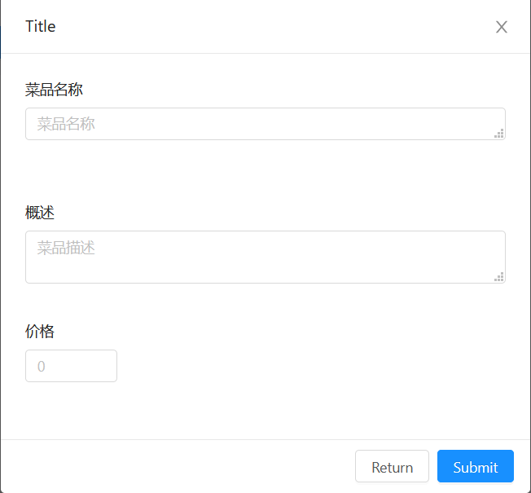
在商品信息编辑子界面中，输入想更改为的商品名称、描述和价格，然后点击“submit”按钮，可修改该商品的上述属性。若不想修改了，点击“return”按钮返回。

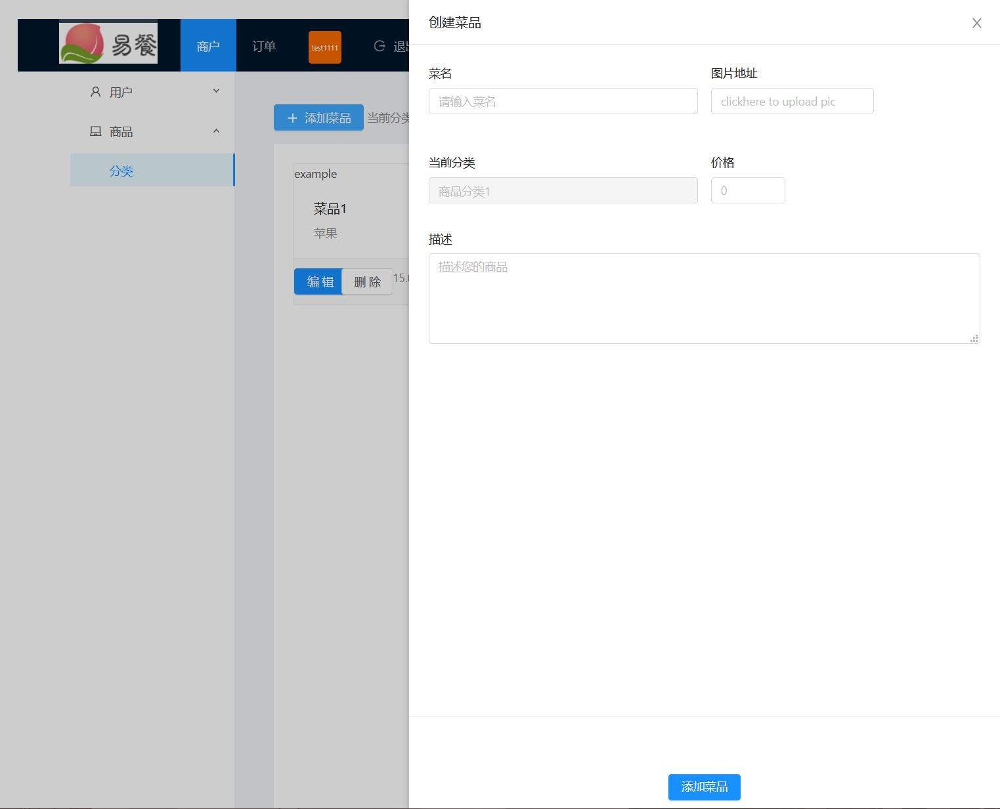
在添加商品子界面中，输入想添加的商品的名称、图片、价格和描述，点击“添加菜品”按钮，会在此分类中添加该新商品。若不想添加了，点击右上的X型按钮返回。

<h3 id='5'>店铺信息界面</h3>

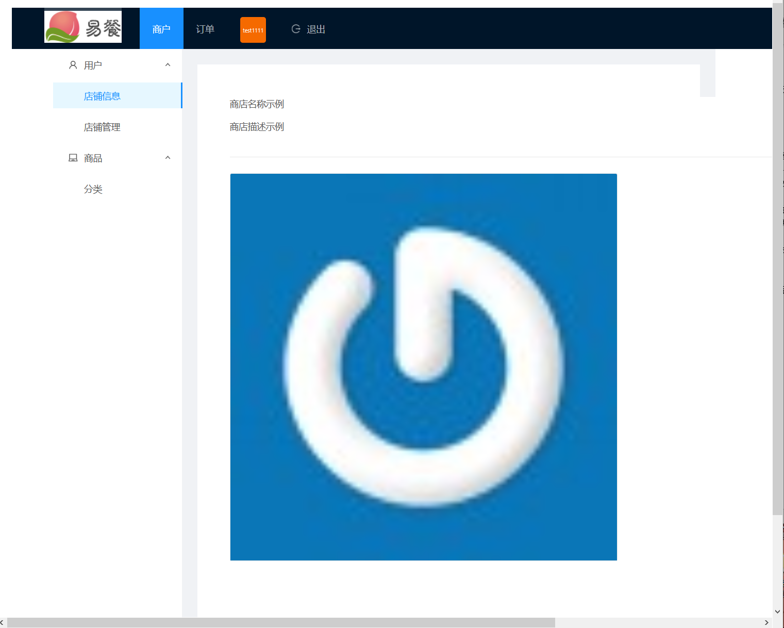
此界面通过登录后，点击左侧导航栏的“用户”分类下的“店铺信息”按钮进入。用于显示店铺的信息，包括店铺名称、店铺描述和店铺头像。

<h3 id='6'>收入统计界面</h3>

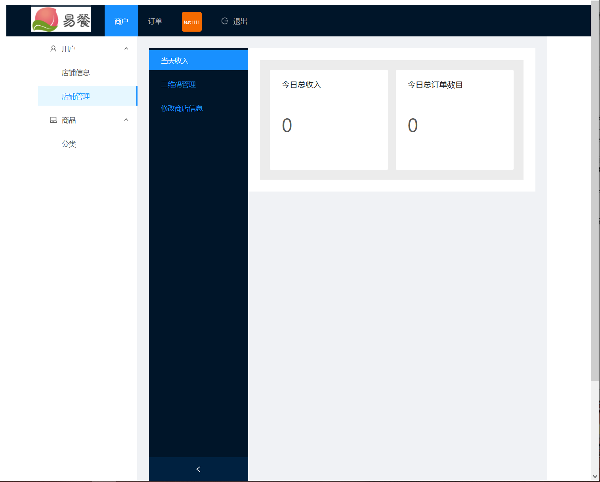
此界面通过登录后，点击左侧导航栏的“用户”分类下的“店铺管理”按钮，再再点击子分类的“当天收入”按钮进入。用于显示收入统计信息，包括今日总收入和今日订单总数目。

<h3 id='7'>二维码管理界面</h3>

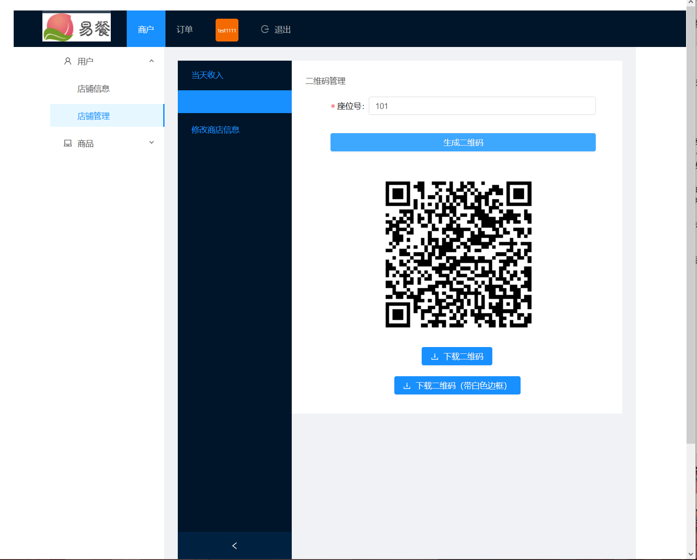
此界面通过登录后，点击左侧导航栏的“用户”分类下的“店铺管理”按钮，再再点击子分类的“二维码管理”按钮进入。用于生成对应座位号的二维码，用户把该二维码贴在对应座位上，供顾客用安卓客户端扫码点餐使用。输入座位号，点击“生成二维码”，会在下方生成对应二维码。生成二维码后，点击“下载二维码”按钮把二维码下载到本地；点击“下载二维码（带白色边框）”按钮把带有白色边框的二维码下载到本地，白色边框可缓解某些情况下的二维码扫码识别问题。

<h3 id='8'>店铺信息编辑界面</h3>

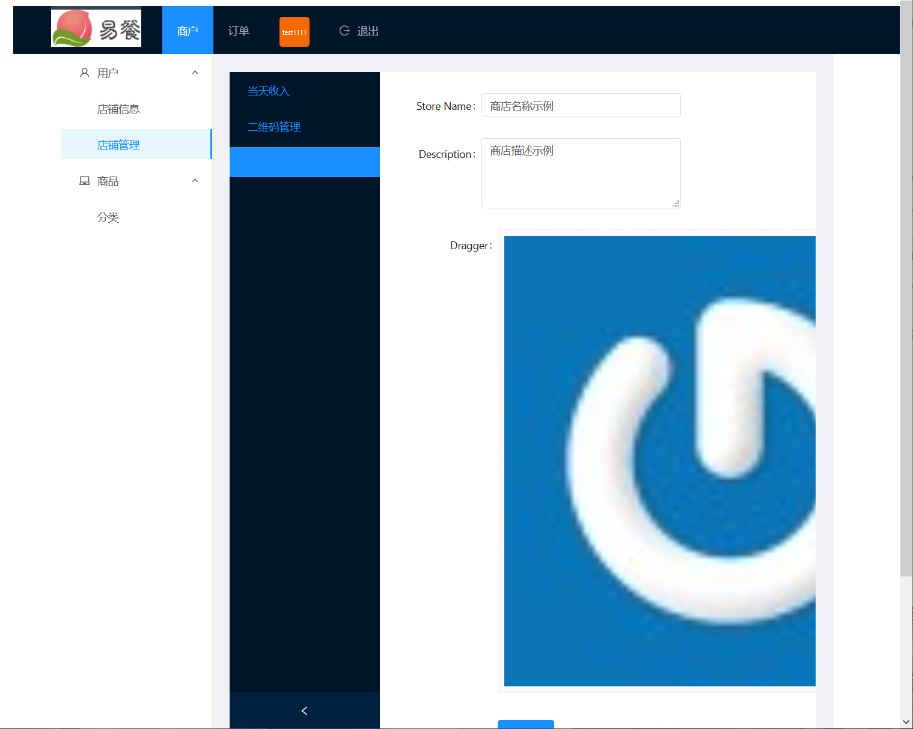
此界面此界面通过登录后，点击左侧导航栏的“用户”分类下的“店铺管理”按钮，再再点击子分类的“修改商店信息”按钮进入。用于修改该账号的店铺信息，包括店铺名称、店铺描述和店铺头像。输入想更改为的店铺信息、店铺描述和店铺头像，点击下方的“Submit”按钮，可修改对应店铺信息。

<h3 id='9'>订单界面</h3>

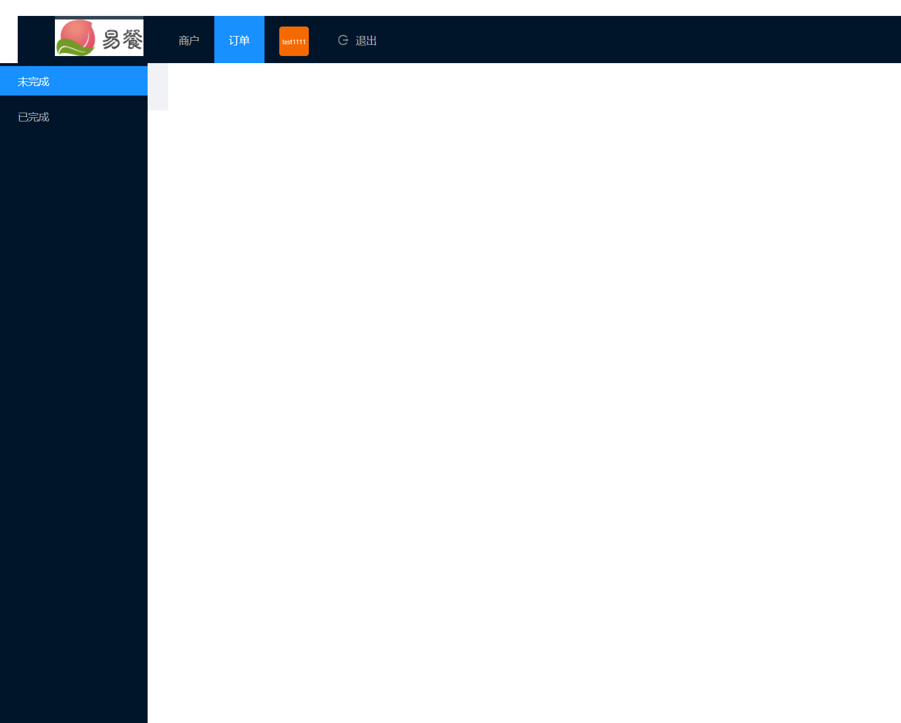
此界面此界面通过登录后，点击上方导航栏的“订单”按钮进入。此界面显示订单信息，分为未完成和已完成，在左边导航栏选择不同分类。
