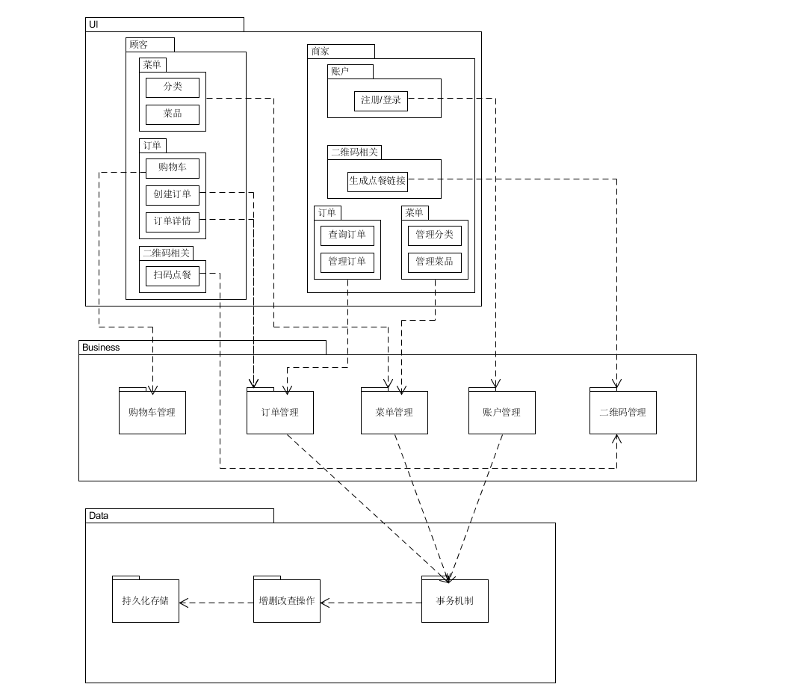
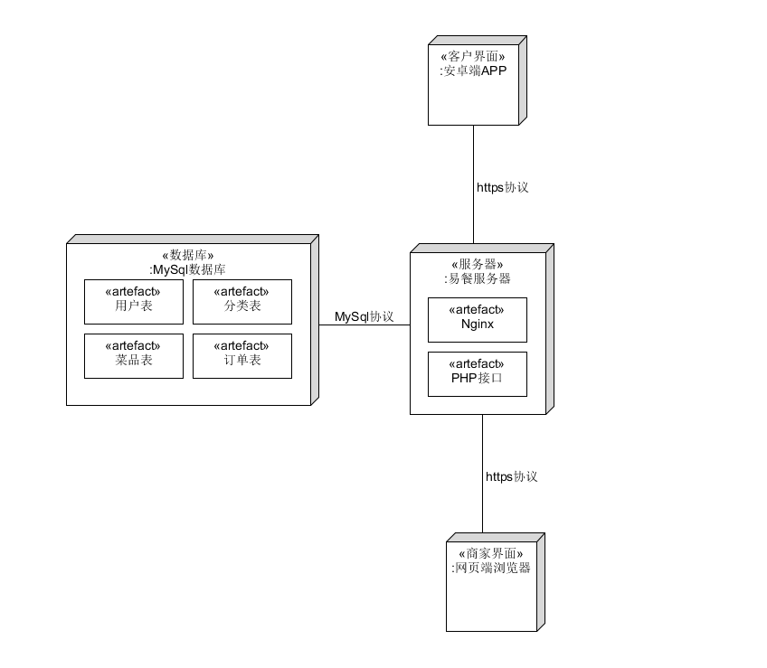

# Software Architecture Document
## 架构问题

### 用户重复提交订单的问题

由于安卓端点击提交订单按钮后是先提交订单再跳转到页面因此可能会产生订单重复提交的问题（比如网络卡顿的时候），为了防止这种问题就需要在前端不允许提交订单按钮的重复点击要么就在后端拒绝反复接受同一订单。

### 鉴权

由于一个服务端同时服务客户端和餐厅端，而且双方调用的API是不一样的。而且我们设计的客户端是无需登录的，因此对于餐厅端调用API进行鉴权。但餐厅端登录和注册是不用鉴权的。

### 后端部署管理框架

为了简化后端部署，需要选用一个框架能轻松配置Linux下的PHP+Nginx+Mysql的环境并实现网络访问。

---

## 解决方案说明

### 用户重复提交订单的问题

订单重复提交的问题由安卓端解决，解决方式是在第一次提交订单后并且未收到服务器返回数据前将提交订单的按钮的点击无效化，这样就能保证跳转到订单界面前不会产生重复提交订单的问题

### 鉴权

鉴权采用的Json Web Token，其原理是服务器认证后生成一个Json对象返回给用户，以后用户与服务端通信的时候都要发回这个Json对象，而服务器也就完全靠这个Json对象认定用户身份。而我们设计的API接口只有部分接口需要对商家拉取信息时进行鉴权防止拉取到其他商家的菜单信息。也就是说除登录注册接口、点餐端接口之外都需要传入Authorization进行鉴权，登录/注册接口返回一个标准的JsonWebToken作为后续鉴权的凭据。对于没有进行正常鉴权的用户则返回401错误。

### 后端部署管理框架

后端开发选用的是PHP+Nginx+Mysql，而且服务器又是linux环境的，因此为了方便部署管理，选用了一个第三方的自动化环境框架OneinStack。

---

## 逻辑视图

   

---

## 物理视图

   

---