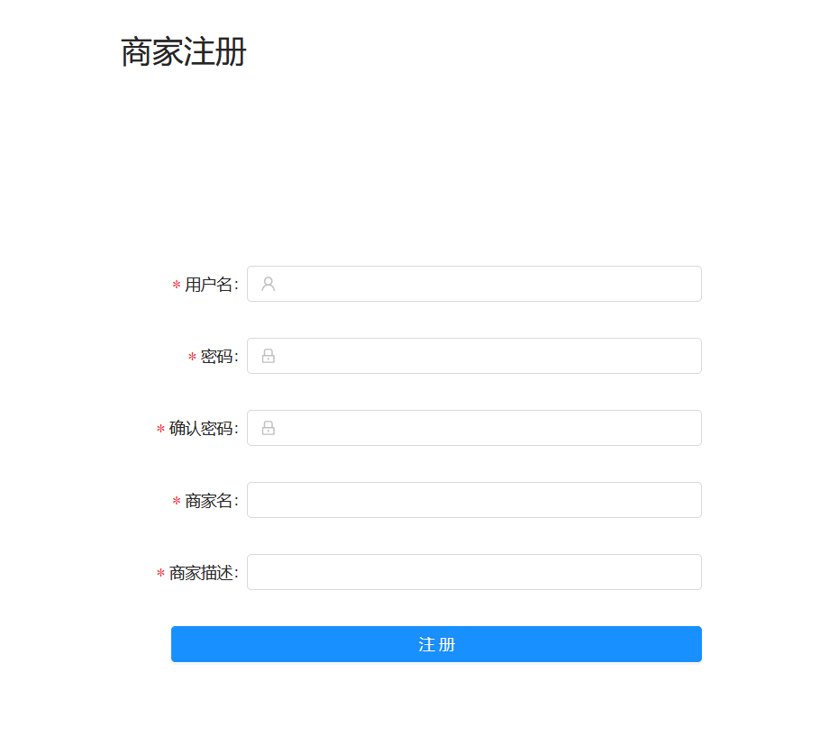
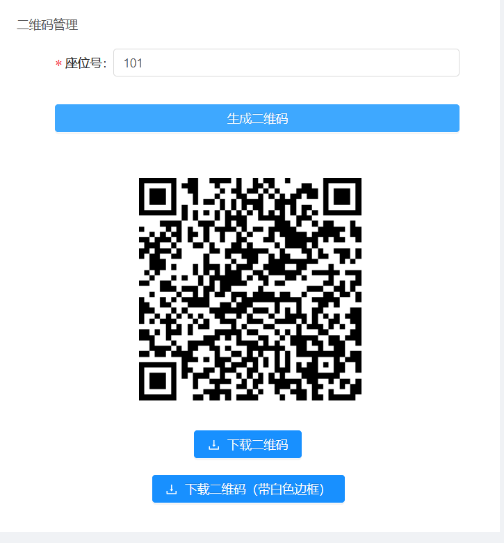
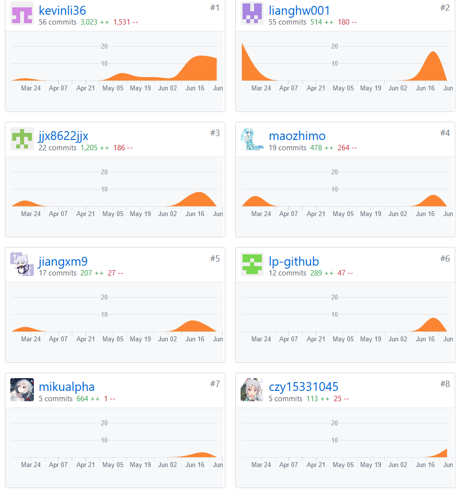
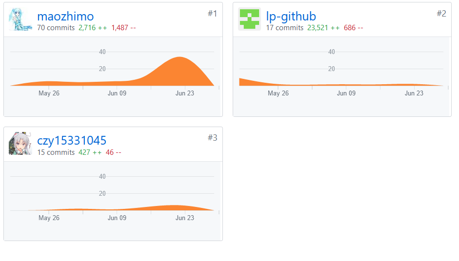

# 15331045-czy15331045 Final Report

---
##个人简短小结

在项目需求探讨会议中，被分配为网页前端小组的成员。初步学习了网页前端和vue框架相关知识。完成了组长分配的任务，负责网页端中注册页面和生成二维码页面的开发。此外还负责网页前端UI文档的编写。

### 分析

- 开会与团队成员一起讨论下一周的实现目标

### 设计

- 设计注册页面和生成二维码页面的用户界面

### 开发

- 初步学习了vue、ant-vue等工具的使用方法
- 开发和测试注册页面和生成二维码页面

---
## PSP 2.1 统计

PSP2.1       | Personal Software Process Stages| Time (%) Senior Student |
------------ | ------------------------------- | ----------------------- |
**Planning** | **计划** | 10 
Estimate  | 估计任务需要的时间 | 10 
**Development**  | **开发** | 70 
Analysis   | 需求分析 | 10 
Design| 具体设计 | 5
Coding| 具体编码 | 40 
Code Review| 代码复审 | 5 
Test| 测试 | 10 
**Reporting** | **报告** | 15 
Document | 前端UI设计文档 | 15 

---
## 主要工作清单

- 最得意： 给生成的二维码加上了白边框

---
## 在项目相关仓库中的贡献，仅需要截图

- git贡献截图

---
## 特别致谢
- 团队队长 kevinli36，完成了整体的领导，督促各个分组完成任务，规划整体时间进度
- 后端团队 提供了详细好用的api文档，解答了关于后端api使用的相关问题
- 网页端小组长maozhimo ，分配了前端的任务，完成了大量其他前端的任务
- 网页端成员 lp-github，完成了大量其他前端的任务
