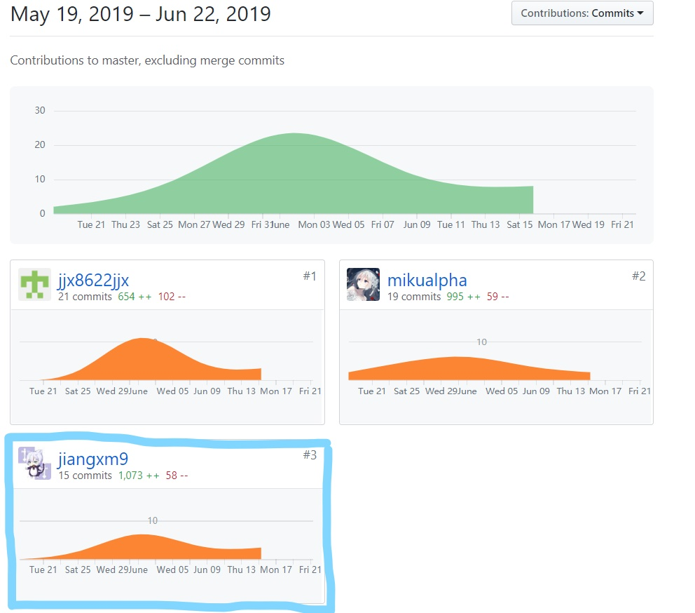

# 16340093-jiangxm9 Final Report

---
## 个人简短小结

    作为团队的后端开发成员，我主要负责的是实现后端部分API接口的实现和编写部分文档。  
    具体工作说起来就是是给我们的后端大佬打下手，查漏补缺以及和网页端及安卓端的团队沟通我负责实现的API接口的参数传递的细节，确保三个部分能正常衔接。

### 管理

- 帮助前后端沟通，保证对接的流畅，主要体现在API文档的完善上

### 分析

- 开会与团队成员一起讨论下一周的实现目标
- 完善API文档
- 完成项目规划文档(about.md)

### 设计

- 设计了部分API接口的输入输出参数的格式

### 开发

- 学习并使用PHP开发部分API接口
- 与后端成员一起协商解决bug，并解决安全访问数据库的问题

## PSP 2.1 统计

PSP2.1       | Personal Software Process Stages| Time (%) Senior Student |
------------ | ------------------------------- | ----------------------- |
**Planning** | **计划** | 5 |
Estimate  | 估计这个任务需要多少时间 | 5 |
**Development**  | **开发** |  85 |
Analysis   | 需求分析 (包括学习新技术) | 10 |
Design Spec| 生成设计文档 | 5 |
Design Review| 设计复审 (和同事审核设计文档)| 5 |
Design|具体设计| 10 |
Coding|具体编码| 30 |
Code Review| 代码复审| 15 |
Test|测试（自我测试，修改代码，提交修改）| 10 |
**Reporting** | **报告** | 10 |
Project Plan Report | 项目规划文档 | 4 |
Domain Model | 领域模型 | 3 |
Database Design| 数据库设计文档 | 3 |

---
## 主要工作清单
- 最得意：短时间里学习了PHP语言并完成了部分API接口从设计到具体实现并debug
- 最有价值：和网页端与安卓端的团队成员保持沟通，确保了API接口参数的正常传递，保证了三个部分能正常连通
- 最有苦劳：没有苦劳
---
## 在项目相关仓库中的贡献，仅需要截图
  

---
## 特别致谢
- 团队队长也是安卓端负责人 kevinli36，规划了项目开发的整体方向，确保了项目的进度，还负责沟通各个端的成员，确保三个部分能正常连通；
- 后端成员 mikualpha，架构了后端开发的框架并实现了部分接口以及部署服务器，是我们后端的大佬；
- 后端成员 assassinjjx， 实现了部分api接口的显示并和我一起讨论解决遇到的bug；
- 安卓端成员 lianghw001，配合 kevinli36完成了安卓端的开发任务；
- 网页端成员 lp-github，maozhimo，czy15331045，完成了网页端的开发任务，并及时与我们后端成员沟通，确保参数的正常传递。