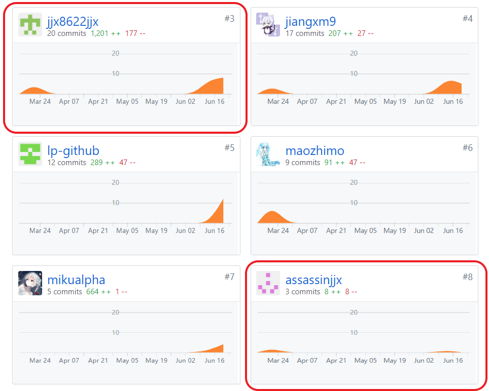
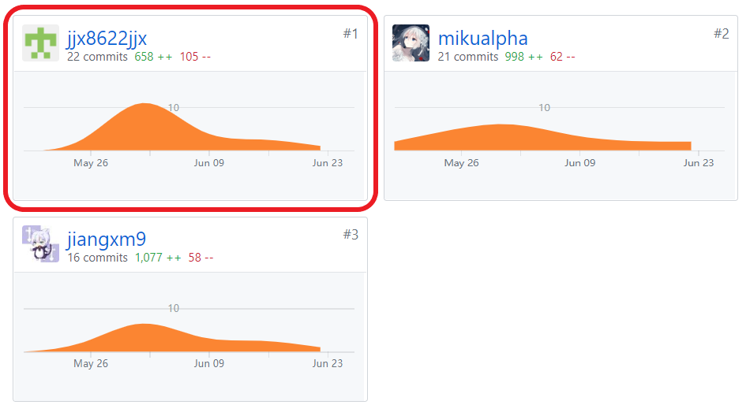

# 项目个人报告
---
**By 16340096-jjx8622jjx, SYSU**  
**On June 23rd**  

## 简短的课程学习自我总结
---
因为团队中除开开发板块以外并没有进行仔细的职能划分，因此个人作为项目的后台成员，除开数据库表结构的设计和创建以及部分后台接口的实现这些范围内的任务，还额外负责了项目前期调研，功能模型文档和用例设计文档的完成。

后台的开发相比较来说称得上是按部就班，在大佬框架的基础上对自己负责的部分进行查漏补缺，同时通过前端和安卓端的反馈来进行调整使得三方可以符合API文档的需求进行连接。

下面分项介绍我在项目完成的内容

### 分析
* 早期对项目及相近类型竞品软件进行的调研给我们的项目提供了基本的设计需求，同时启发了产品特性的几个细节，包括结合到店消费的背景实行线上结账、线下支付的运营模式等。
* 与后台成员一起讨论，根据接口文档和用例图，模拟到店点餐场景，去除掉餐桌号和二维码的数据库存储，也取消掉了线上评价的部分，并将余下的部分进行适当的整合，构造最简化数据库模型以有效减少资源的消耗。
* 开会参与细节实现的讨论。

### 设计
* 根据我们现行的软件版本分析系统功能模块，完成系统流程图的绘制，使系统的运作流程直观而准确。具体参考[6.5 System Sequence Diagram 功能模型](06-05-System-Sequence-Diagrams)。
* 根据用例图和现行功能设计，完成系统用例设计说明，使项目从需求到到开发的过程直观而明晰。具体参考7.5 用例设计。
* 设计数据库ER模型。具体参照[7.2 Database design 数据库设计](07-02-Database-Design)。

### 开发
* 完成数据库模型的建立，以及对部分数据表的增删改查操作，并将其封装成类，方便逻辑层调用。
* 完成后台逻辑层中，商品分类管理和订单管理系统部分的API。

### 管理
* 与web前端及安卓端小组互相协调，一起讨论、核对接口。详见[Document(API)](Document(API))。

## PSP2.1 表格
---

|  | Personal Software Process Stages | Time (%) |
| :------: | :------: | :------: |
| **Planning** | **计划** | **7** |
| estimate | 预估任务时间 | 7 |
| **Development** | **开发** | **83** |
| analysis | 需求分析 | 15 |
| design spec | 生成设计文档 | 4 |
| estimate | 设计复审（与前端团队成员审核设计文档） | 5 |
| coding standard | 代码规范 | 2 |
| design | 具体设计，包括绘制 UI，设计架构等 | 12 |
| coding | 具体编码 | 25 |
| code review | 代码复审 | 5 |
| test | 测试（修改代码） | 15 |
| **Report** | **报告** | **10** |
| test report | 测试报告 | 4 |
| size measurement | 计算工作量 | 2 |
| postmortem & process improvement plan | 事后总结&提出改进计划 | 4 |

## 最得意/或有价值/或有苦劳的工作清单
---
* **最得意:** 分析需求和设计数据库。结合到店点餐的具体情境分析，去除掉冗余的数据库存储功能，精简数据库设计，是数据库的资源消耗极大地减少。
* **最有价值:** 将数据库模型中对应数据表的操作分别封装成一个类，实现面向对象，使得逻辑层对表进行操作时，无需考虑 sql 语句，只需调用类中所提供的增删改查操作，即可完成对于数据库的操作。
* **最有苦劳:** 虽然功能模型和用例设计文档写成md格式的行数不多，但是里面每张图片的绘制都非常得费时费力，所花时间甚至可能要超过完成那些上百行文档所需的时间。

## 个人GIT总结
---
### pages 文档集合

### Web-Server-Side 点餐系统后台

## 特别致谢
---
* 项目组长kevinli36，按期安排和督促任务进度，使得项目可以顺利推进。
* 后台组长jiangxm9，和我一同完成后台的部分API和数据库功能，并在个人本地环境出现问题的时候帮忙调试。
* 后台成员mikualpha，在项目开发过程中，他较早地完成了后台框架的搭建以及服务器的部署，使得后台的开发任务变得简单顺利，并且可以及时地进行接口的调试，为整个项目的开发提供了较好的测试支持。
* 整个项目团队里的所有其他成员，缺少了任何一个人都无法完成这个项目。
