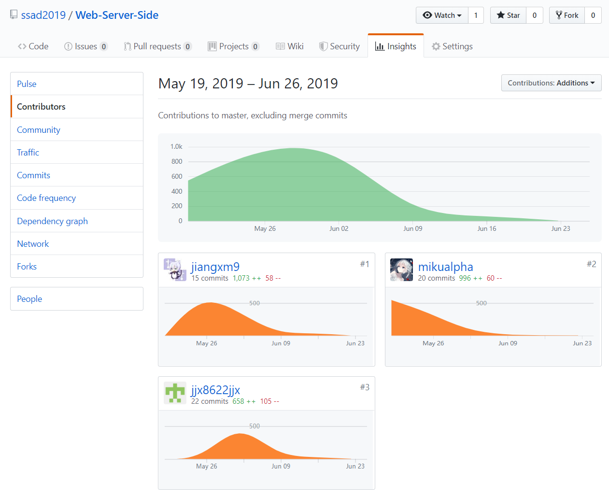

# 16340105-mikualpha Final Report

---
## 个人简短小结

本次项目开发过程中，帮助了整个团队研究整体需求和选择合适的技术，并完成API文档，保证三个方向可以正常对接。

在Web服务端的开发中，主要负责整体开发结构的设计，和登录/注册、图片上传、文件安全访问等模块的实现，并完成了服务器的搭建与部署。

### 管理

- 完成API文档，保证三个开发方向可以正常对接
- 对Web服务端开发的代码规范、安全性进行了管理
- 对服务器各成员访问权限(FTP、MySQL等)进行了管理

### 分析

- 与团队成员一起讨论下一周的实现目标
- 完成API文档、代码规范文档
- 完成服务端与部分前端的部署文档

### 设计

- 设计了整体API结构及部分具体的API接口
- 设计Web服务端的整体开发结构，通过.gitignore/Composer等方式，保证了服务端开发整体的安全(不将数据库密码、加密密钥等上传)和简洁(不将开发中的测试文件、缓存文件上传)。

### 开发

- 学习JsonWebToken、Composer、Nginx等技术及软件的使用方法
- 实现无状态访问API的方法
- 实现有效防止远程执行代码漏洞攻击，安全通过API上传文件的方法
- 完成登录/注册、图片上传以及部分数据库访问接口的实现
- 与其他成员一起协商解决Bug

## PSP 2.1 统计

PSP2.1       | Personal Software Process Stages| Time (%) Senior Student |
------------ | ------------------------------- | ----------------------- |
**Planning** | **计划** | 5 |
Estimate  | 估计这个任务需要多少时间 | 5 |
**Development**  | **开发** | 80 |
Analysis   | 需求分析 (包括学习新技术) | 10 |
Design Spec | 生成设计文档 | 5 |
Design Review| 设计复审 | 5 |
Design| 具体设计 | 10 |
Coding| 具体编码 | 30 |
Code Review| 代码复审 | 10 |
Test| 测试（自我测试，修改代码，提交修改） | 10 |
**Reporting** | **报告** | 15 |
API Design| API设计文档 | 7 |
Install Document| 部署文档 | 5 |
Code Standards| 代码规范 | 3 |

---
## 主要工作清单

- 最得意：学习了JWT与Composer的使用，并将其有效地利用于实际开发中，使其它服务端开发者无需了解实际技术即可对其进行调用，提高了开发的速度。
- 最有价值：将鉴权、数据库访问、JSON输出等函数进行了大规模的封装和复用，提高了服务端开发的整体效率；制定了服务端的代码规范，有效提高了代码的可读性与可维护性。
- 最有苦劳：完成了大部分的API设计，协助其它开发方向解决了部分API使用方面的问题，并解决了一些BUG。

---
## 在项目相关仓库中的贡献，仅需要截图

- 文档git贡献截图  

- 后端git贡献截图  
  

---
## 特别致谢

- 组长 kevinli36，认真完成了各次小组会议，有效推动了各部分的正常开发，而不至于出现由于进度不一致导致的各种问题；
- 后端成员 assassinjjx、jiangxm9，按时高质量地完成了部分API的设计与开发，减少了很多不必要的问题；
- Android端成员 lianghw001，配合kevinli36按时完成了安卓端的开发任务；
- 前端成员 lp-github，在几乎是完全自学的情况下按时按量地完成了前端的开发任务，并对API的使用情况及出现的问题及时进行沟通。