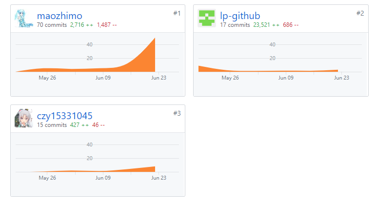

# 16340107-maozhimo Final Report

---
## 个人简短小结

作为前端开发组长，团队中我主要负责管理进度和分配任务，个人前期负责主要ui设计和界面逻辑，后期负责完成实现商品及相关功能，负责部分开发文档。
由于本身没有接触过VUE所以进度很慢，只能不断调整分工来在规定期限内完成。同时和安卓端、后端积极沟通，完成测试和协同开发。

### 管理

- 管理前端进度，分配工作
- 与安卓端、后端进行沟通，提出改进

### 分析

- 开会与团队成员一起讨论下一周的实现目标
- 分析当前问题提出改进方案，规避风险
- 根据个人能力进行重新分配，根据整体使用向其他组提出建议

### 设计

- 设计主题UI
- 设计主要页面逻辑，商品相关数据交互和显示实现

### 开发

- 学习并使用VUE，使用VUE与js进行开发
- 和后端进行数据实验和反馈，解决各种错误信息
- 整合进度进行开发实验，导入数据

## PSP 2.1 统计

PSP2.1       | Personal Software Process Stages| Time (%) Senior Student |
------------ | ------------------------------- | ----------------------- |
**Planning** | **计划** | 10 
Estimate  | 估计这个任务需要多少时间 | 5 
distribute  | 进行大概组员分工 | 5 
**Development**  | **开发** | 80 
Analysis   | 需求分析  | 10 
Design Spec| 分工设计 | 10 
Design|具体设计| 5
Coding|具体编码| 45 
Code Review| 代码复审| 5 
Test|测试（自我测试，修改代码，提交修改）| 10 
**Reporting** | **报告** | 10 
Project Plan Report | 项目规划文档 | 4 
Domain Model | 领域模型 | 3 
UI Reporte | UI设计文档 | 4 

---
## 主要工作清单

- 最得意：实现了动态生成和动态绑定功能
- 最有价值：分工协调积极确认，完成了前端的有序进行
- 最有苦劳：实现商品相关模块设计

---
## 在项目相关仓库中的贡献，仅需要截图

- git贡献截图  
  

---
## 特别致谢

- 团队队长 kevinli36，完成了整体的领导，督促各个分组完成任务，规划整体时间进度
- 后端团队 提供api文档作为需求，解决数据传输相关问题，积极协同改进相关逻辑
- 后端团队 完成前端的开发，等待后端拖慢的进度共同解决
- 网页端成员 lp-github，完成分工任务，并承担了后期的测试，解决其他技术问题；
- 网页端成员 czy15331045，完成二维码相关和注册模块，确保进程进行，完成UI设计文档。
