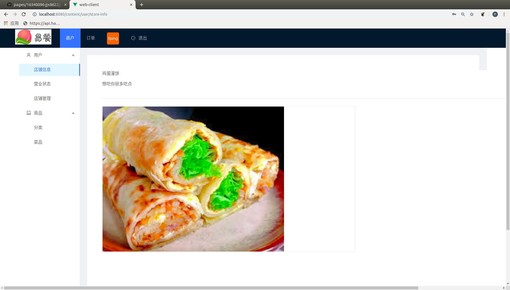
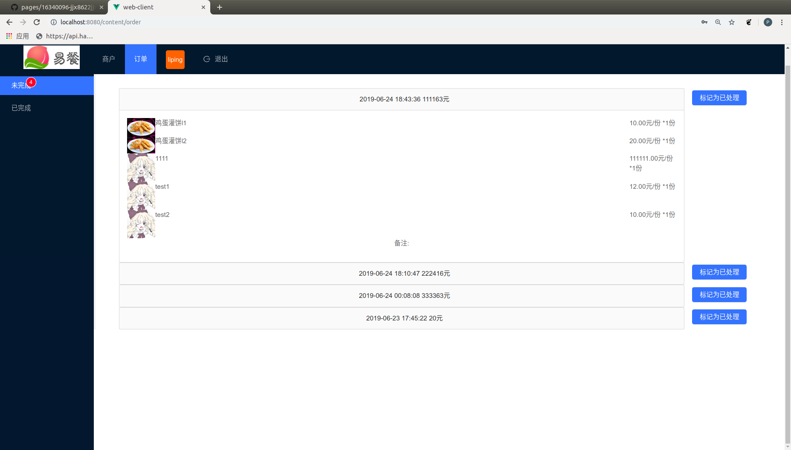

# 项目个人报告
---
**By 16340121,lp-github, SYSU**  
**On June 24th**  

## 简短的课程学习自我总结
---
在项目需求探讨会议中，分配到了网页前端工作的一员，关于网页前端的知识，个人之前并没有接触过，于是在实现前端小组长布置的任务时非常努力。
我在前端的开发任务中负责了项目的初始化，登录界面的UI设计和后端的通信，显示商店信息和修改商店信息的UI及后端通信，动态显示商店当日营业额和当日订单数目，动态刷新订单。大部分UI的设计使用Ant vue的组件，部分组件Ant-vue组件不能实现需求，所以自己手动设计。总体上来说没有太难，主要是父子组件之间的通信，路由的设置，页面刷新时如何保持token，后端api接口的调用---尤其是上传图片的方法花费了不少功夫。前端开发的同时，和后端协助调试api，后端开发组员对api的bug报告反馈得很及时。

下面分项介绍我在项目完成的内容

### 分析
* 项目启动时确定了前端的主要页面设计，根据已经设计好的api雏形规划了前端的基础功能和UI设计，选择以vue为基本架构，确定了设计阶段需要包含的界面：登录注册和商家页面作为交互。

### 设计
* 登录界面

* 商家主界面

* 商家订单界面

### 开发
* 完成UI设计
* 实现页面加载和响应逻辑
* 实现多个组件之间的通信
* 实现路由
* 添加多线程任务以保持客户端数据和后端数据的实时同步
* 正确使用后端设计的api，拉取和上传数据

### 管理
* 向后端api设计小组反馈接口的bug

## PSP2.1 表格
---

|                                       |    Personal Software Process Stages    | Time (%) |
| :-----------------------------------: | :------------------------------------: | :------: |
|             **Planning**              |                **计划**                |  **10**   |
|               estimate                |              预估任务时间              |    10     |
|            **Development**            |                **开发**                |  **85**  |
|               analysis                |                分析功能需求               |    10    |
|              design              |              设计UI和逻辑，选择框架              |    10     |
|                coding                 |                开发                |    50    |
|              test              |                逻辑测试UI微调                |    15     |
|              **Report**               |                **报告**                |  **5**  |
|              install document              |                安装部署说明书                |    5     |

## 最得意/或有价值/或有苦劳的工作清单
---
* **最得意:** 成功的上传图片
* **最有价值:** 商店订单的动态刷新，频率太快的话，页面变更太快，用户使用体验差；频率太慢，数据同步的实时性太差，不利于用户及时接收订单提醒。于是采用高频率的数据同步，每次拉取数据先和本地数据对比，如果数据和拉取的数据一致则不对UI绑定数据进行修改，数据不同步的情况下才重新渲染UI，这样在大多数情况下UI都不会发生变化，给用户观感上带来良好的体验，同时又能在后端数据发生变化时及时更新订单列表，不至于错过新的订单。
* **最有苦劳:** vue开发环境的配置，开发过程中遇到了各种神秘报错，除了缺失依赖的简单环境问题，更有其他的版本适配问题和系统权限问题

## 个人GIT总结

### Web-Client 点餐系统网页端

## 特别致谢
---
* 项目组组长kevinli36, 同时是安卓端的组长和组员，每周召开会议验收各部分的阶段任务，监督各部分的进度，督促了项目各部分能如期完成。
* 安卓端组员lianghw001，完成了部分安卓UI的设计和逻辑的实现
* 后端小组长jiangxm9，设计并实现了部分API，及时反应前端反馈的bug并修复
* 后端成员mikualpha，比较早的实现了api的设计，决定了各部分的设计根据，方便了web端和安卓端的设计。
* 后端成员assassinjjx，实现了部分接口，方便了前端的数据测试
* web前端小组长maozhimo ，分配前端的任务，实现UI的实现和后端数据的通信。
* web前端成员czy15331045，完成了网页端的开发任务，实现了二维码，和安卓端的通信
