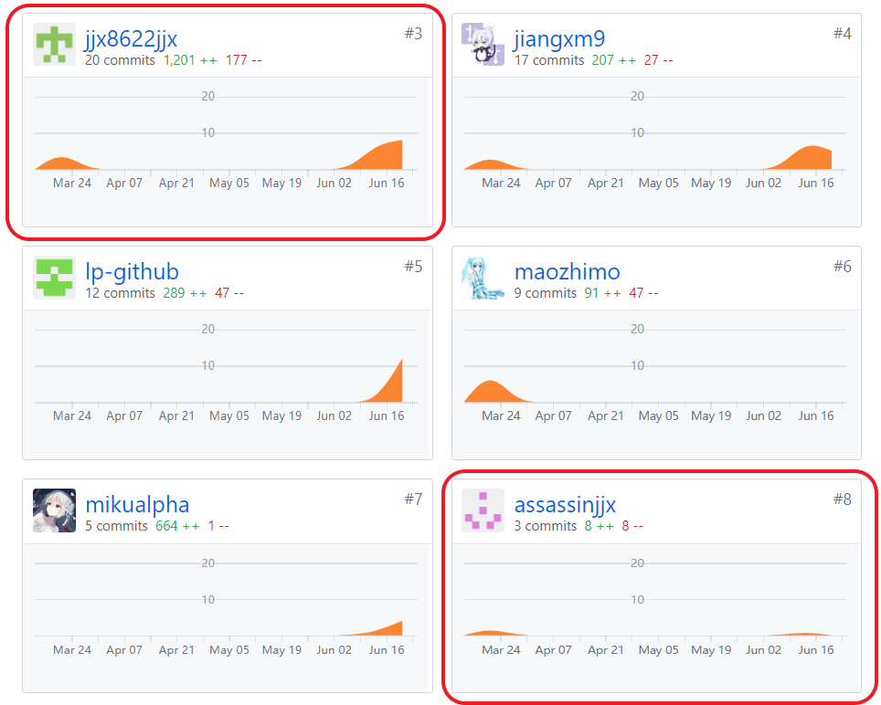

# 项目个人报告
---
**By 16340125, kevinli36, SYSU**  
**On June 24th**  

## 简短的课程学习自我总结
---
在项目需求探讨会议中，我作为项目组组长，积极和组员进行讨论，最后将项目分为安卓端，网页前端和服务端3个部分，并定kevinli36，maozhimo和jiangxm9分别为安卓、网页前端和网页后端的负责人，负责各部分的工作安排。

之后在团队协作上，我作为组长确定每周组内会议的时间并按时组织组员开会，每次会议流程明确————总结验收上一周的开发任务，并确定下一周的实现目标。虽然有一定的拖ddl的现象，但是总体上的进度并没有落下。

最后最为安卓端的负责人，在UI设计和功能实现两个方面，我积极和组员lianghw001讨论，最后顺利完成安卓端的开发工作。

下面分项介绍我在项目开发中的贡献

### 分析
安卓端UI界面包括扫描，主菜单，商店详情，菜品详情，订单确认，订单信息6个界面，除此之外还包括用于从Json中解析数据的Food类和Restaurant类，以及用于网络访问的Network单例和用于存储数据的StoreData单例。

在这之中，我负责的有主菜单，商店详情，菜品详情，订单确认以及订单信息5个界面的UI设计及逻辑，以及StoreData单例的设计。

### 设计
* 主菜单

主界面上部分为商店信息，点击可进入商店详情界面。往下是两个互相联动的ListView，左部分是FoodType，右部分是FoodDetail。左边部分点击，右边部分会跳转到相应type目录下; 右边部分滑动，左边部分切换到相应的type。

FoodDetail内部item中可以点击button来添加菜品到订单或者从订单中删除菜品，点击item跳转到相应的菜品详情界面。

底部的button分为两部分，左边部分显示当前订单的总价，点击可以查看订单列表，在订单列表中可以添加删除菜品。右边部分跳转到订单确认界面。

* 商店详情

商店界面显示商家的图片，名字以及详细介绍。

* 菜品详情

菜品界面显示菜品的图片，名字以及详细介绍。点击button可以添加当前菜品订单或者从订单中删除菜品。

底部的button设计与主界面相同。

* 订单确认

订单确认界面显示订单详情以及订单信息，在订单信息中可以添加订单备注。

底部的button样式与主界面相同，但左部分取消查看订单列表的点击事件，右部份跳转到订单信息界面。

* 订单信息

订单信息界面显示订单详情以及订单信息，订单信息包括订单号，订单时间以及支付方式（固定为线下支付）。

### 开发
* 完成UI设计，包括界面layout的xml文档和button控件的xml文档
* 完成多功能ListViewAdapter设计，包括双联动ListView的Adapter，带内部点击事件的Adapter，按照Id加载不同的Item样式的Adapter。

  除此之外，在Adapter中加入菜品图片加载的方法，避免一次性加载所有菜品图片导致扫描界面到主界面的跳转卡顿。
* 实现页面加载和响应逻辑，包括各界面之间的点击跳转逻辑，button添加/删除订单菜品逻辑，以及使用队友写好的Network方法获得商家数据和提交订单。

### 管理
* 与网页前端积极合作进行debug
* 与组员lianghw001积极讨论UI设计和功能实现方法

### 文档
* 完成Android代码开发规范文档
* 完成用例图绘制
* 完成活动图绘制

## PSP2.1 表格
---

|                                       |    Personal Software Process Stages    | Time (%) |
| :-----------------------------------: | :------------------------------------: | :------: |
|             **Planning**              |                **计划**                |  **5**   |
|               estimate                |              预估任务时间               |    5     |
|            **Development**            |                **开发**                 |  **85**  |
|               analysis                |                需求分析                 |    10    |
|              design spec              |              生成设计文档                |    5     |
|               estimate                | 设计复审（与前端团队成员审核设计文档）     |    5     |
|            coding standard            |                代码规范                 |    5     |
|                design                 |   具体设计，包括绘制 UI，设计架构等       |    25    |
|                coding                 |                具体编码                 |    25    |
|              code review              |                代码复审                 |    5     |
|                 test                  |            测试（修改代码）              |    5    |
|              **Report**               |                **报告**                 |  **10**  |
|              test report              |                测试报告                  |    5     |
|           size measurement            |               计算工作量                 |    1     |
| postmortem & process improvement plan |         事后总结&提出改进计划             |    4     |

## 最得意/或有价值/或有苦劳的工作清单
---
* **最得意:** 不同功能的ListViewAdapter实现，各个ListView内部点击事件的响应处理。
* **最有价值:** 任务分配，按时组织小组会议，积极参与组内讨论，及时跟踪整个项目组的进度。
* **最有苦劳:** 界面及控件的xml设计。

## 个人GIT总结
---
### pages 文档集合

### Web-Server-Side 点餐系统后台

## 特别致谢
---
* 后端组长jiangxm9，合理安排后端开发任务，在开发过程中没有一次拖延ddl，保质保量完成开发任务和文档工作。
* 前端组长maozhimo，积极组织组员学习Vue框架，在没有基础的情况下尽全力完成开发任务。
* 安卓端成员lianghw001，在项目开发过程中积极与我讨论安卓端UI设计和功能实现的具体方法，能指出了我在开发中设计与实现的问题并积极与我讨论解决方案。
* 整个项目团队里的所有成员，感谢每一位成员的努力与付出，缺少了任何一个人都无法完成这个项目。
