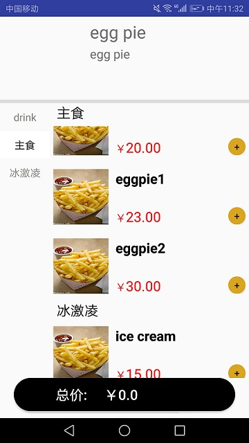

## 模仿美团双ListView列表联动效果

[参考博客](https://blog.csdn.net/zhaozhuzi/article/details/76280627)



### 实现功能

- 右部列表顶部标题栏显示当前列表第一个item的类别，当需要更新时，标题栏上移消失更新为新的标题

- 右部列表本身item带标题栏显示item类别，当与上一个item类别相同时标题栏不显示

- 左右两个列表联动，点击左边部分的item，右边列表会跳转到相应的类别下; 滑动右边部分列表，左边列表被选中状态的item会相应变化

### 实现细节

#### 自定义带标题栏的PinnedListView

由于默认ListView控件并不能实现我们上述提到的标题栏切换功能，因此自定义带标题栏的ListView，通过改变标题栏的状态（不显示，显示，上移）来动态绘制Header。

```
    switch (state) {
        case PinnedListViewAdapter.PINNED_HEADER_GONE: {
            //如果是不可见的状态，就不绘制HeaderView
            bln_is_headerViewVisible = false;
            break;
        }
        case PinnedListViewAdapter.PINNED_HEADER_VISIBLE: {
            //如果当前是可见的状态，设置HeaderView的内容
            pinnedListViewAdapter.configurePinnedHeader(view_header, position);
            //将被隐藏的HeaderView(在界面外绘制)摆放到顶部
            if (view_header.getTop() != 0) {
                view_header.layout(0, 0, int_headerViewWidth, int_headerViewHeight);
            }
            //绘制HeaderView
            bln_is_headerViewVisible = true;
            break;
        }
        case PinnedListViewAdapter.PINNED_HEADER_PUSHED_UP: {
            //获取第一个view
            View firstView = getChildAt(0);
            //返回View自身底边到父布局顶边的距离
            int bottom = firstView.getBottom();
            //HeaderView的高度
            int headerHeight = view_header.getHeight();
            int y;
            if (bottom < headerHeight) {
                y = (bottom - headerHeight);
            } else {
                y = 0;
            }
            //绘制HeaderView的内容
            pinnedListViewAdapter.configurePinnedHeader(view_header, position);
            //摆放HeaderView
            if (view_header.getTop() != y) {
                //HeaderView上移y
                view_header.layout(0, y, int_headerViewWidth, int_headerViewHeight + y);
            }
            bln_is_headerViewVisible = true;
            break;
        }
    }
```

在PinnedListViewAdapter中，根据第一个item的类别与当前Header的text，设置Header的状态

```
     /**
      * 获取列表头状态
      * @param position int item位置
      * @return int 预先定义好的状态int
      */
    public int getPinnedHeaderState(int position) {
        if (position < 0) {
            return PINNED_HEADER_GONE;
        }
        //当条目标题和上一个标题不同的时候，显示上移
        if (position != 0 && !TextUtils.equals(list_data.get(position).getType(), list_data.get(position + 1).getType())) {
            return PINNED_HEADER_PUSHED_UP;
        }
        return PINNED_HEADER_VISIBLE;
    }

     /**
      * 设置列表头内容
      * @param header View 列表头TextView
      * @param position int item位置
      */
    public void configurePinnedHeader(View header, int position) {
        Food item = (Food) getItem(position);
        if (item != null) {
            if (header instanceof TextView) {
                ((TextView) header).setText(item.getType());
            }
        }
    }
```

#### item标题栏的显示

判断与上一个item的类别是否相同，根据判断结果决定是否显示标题栏

```
    if (position == 0) {//如果是第一个  需要显示标题
        viewHolder.txt_type.setVisibility(View.VISIBLE);
        viewHolder.txt_type.setText(list_data.get(position).getType());
        //如果这个标题和上一个不一样   也需要将标题显示出来
    } else if (!TextUtils.equals(list_data.get(position).getType(), list_data.get(position - 1).getType())) {
        viewHolder.txt_type.setVisibility(View.VISIBLE);
        viewHolder.txt_type.setText(list_data.get(position).getType());
    } else {
        viewHolder.txt_type.setVisibility(View.GONE);
    }
```

#### ListView联动

思路为互相监听点击/滑动事件。左侧ListView在点击事件中通过`setSelection`函数使右侧ListView跳转；右侧ListView在滑动事件中使用`smoothScrollToPosition`函数和自定义的`changeSelected`使左侧ListView切换被选中的item。需要注意的是应在滑动结束后再调用函数。

```
    lv_food_detail.setOnScrollListener(new AbsListView.OnScrollListener() {
        @Override
        public void onScrollStateChanged(AbsListView absListView, int scrollState) {
            //获取当前滚动状态确定是否触发滚动事件
            if(scrollState == SCROLL_STATE_TOUCH_SCROLL || scrollState == SCROLL_STATE_FLING){
                bln_is_scroll_end = true;
            }else{
                bln_is_scroll_end = false;
            }
        }
        @Override
        public void onScroll(AbsListView absListView, int firstVisibleItem, int visibleItemCount, int totalItemCount) {
            if(!bln_is_scroll_end){
                return;
            }
            //滚动确定替换条目
            lv_food_detail.configureHeaderView(firstVisibleItem);
            //获取到第一个条目的类型
            String str_title = data_instance.list_all_food.get(firstVisibleItem).getType();
            int int_position = data_instance.list_type.indexOf(str_title);
            lv_food_type.smoothScrollToPosition(int_position);
            simpleListViewAdapter.changeSelected(int_position);
        }
    });

    lv_food_type.setOnItemClickListener(new AdapterView.OnItemClickListener() {
        @Override
        public void onItemClick(AdapterView<?> parent, View view, int position, long id) {
            for(int i = 0; i < data_instance.list_all_food.size(); i++){
                if(data_instance.list_all_food.get(i).getType().equals(data_instance.list_type.get(position))) {
                    lv_food_detail.setSelection(i);
                    break;
                }
            }
            simpleListViewAdapter.changeSelected(position);
        }
    });
```

## 包含不同样式item的ListView

[参考博客](https://www.cnblogs.com/bdsdkrb/p/4890598.html)

### 实现功能

- ListView包含不同的item，根据数据不同加载不同的item样式xml文件

### 实现细节

主要思路为给列表数据加上id，根据不同的id加载不同的样式文件。

List数据构造
```
public class TypeListViewItem {
    public int type;
    public HashMap<String, Object> map;

    public static final int TYPELISTITEMVIEW_TYPE_1 = 0;
    public static final int TYPELISTVIEWITEM_TYPE_2 = 1;
    public static final int TYPELISTVIEWITEM_TYPE_3 = 2;

    public TypeListViewItem(int type, HashMap<String, Object> map) {
        this.type = type;
        this.map = map;
    }
}
```

根据id加载样式文件
```
    if (convertView == null) {
        switch (type) {
            case TYPELISTITEMVIEW_TYPE_1:
                viewHolderType1 = new ViewHolderType1();
                convertView =  LayoutInflater.from(context).inflate(R.layout.item_payment_type1, null);
                viewHolderType1.lv_order = (ListView)convertView.findViewById(R.id.lv_order);
                viewHolderType1.txt_sum = (TextView)convertView.findViewById(R.id.txt_total);
                convertView.setTag(R.id.item_type1, viewHolderType1);
                break;
            case TYPELISTVIEWITEM_TYPE_2:
                viewHolderType2 = new ViewHolderType2();
                convertView =  LayoutInflater.from(context).inflate(R.layout.item_payment_type2, null);
                viewHolderType2.edit_remark = (EditText)convertView.findViewById(R.id.edit_remark);
                convertView.setTag(R.id.item_type2, viewHolderType2);
                break;
            case TYPELISTVIEWITEM_TYPE_3:
                viewHolderType3 = new ViewHolderType3();
                convertView =  LayoutInflater.from(context).inflate(R.layout.item_final_type3, null);
                viewHolderType3.txt_id = (TextView) convertView.findViewById(R.id.txt_order_id);
                viewHolderType3.txt_time = (TextView) convertView.findViewById(R.id.txt_order_time);
                convertView.setTag(R.id.item_type3, viewHolderType3);
                break;
        }
    }
```

## 线程管理

[参考博客](https://blog.csdn.net/qq_39716220/article/details/84894316)

为了解决一次性加载图片导致等待时间过长的问题，将通过网络访问加载图片的步骤放入ListViewAdapter中，但是在实验过程中出现了程序卡死的情况，查阅博客资料发现是同一时间的线程过多导致的，可以通过限制同一时间执行的线程数量来解决。

```
    public ExecutorService threadPool = Executors.newFixedThreadPool(3);

    StoreData.getInstance().threadPool.execute(new Thread() {
        @Override
        public void run() {
            list_data.get(int_position).getBitmapbyUrl();
            handler.sendEmptyMessage(HANDLER_MESSAGE);
        }
    });

    private Handler handler = new Handler() {
        public void handleMessage(android.os.Message msg) {
            switch (msg.what) {
                case HANDLER_MESSAGE:
                    notifyDataSetChanged();
                    break;
                default:
                    break;
            }
        }
    };
```


