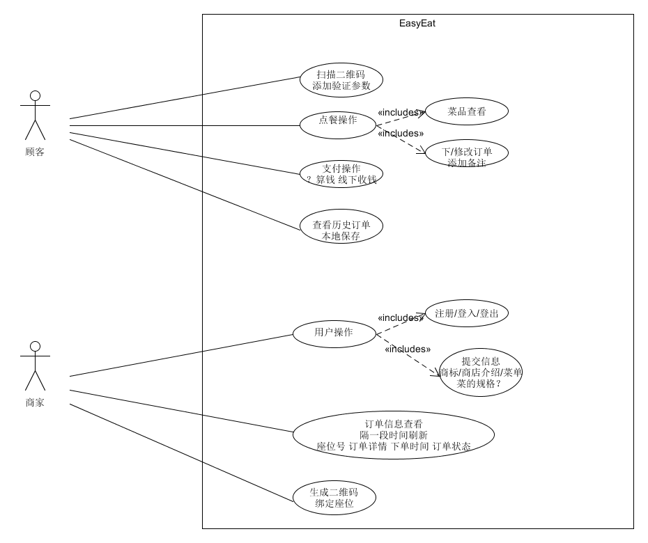

# 第三次会议记录

## 会议时间: 2019.05.19

## 会议人员: assassinjjx，jiangxm9，kevinli36，lianghw001，lp-github，maozhimo，czy15331045，mikualpha

## 会议内容:

本次会议确定总结了上一周的任务，讨论了系统的具体用例图以及基本的UI设计模板，并对下一周的任务进行了安排。

[网页前端参照](https://jingyan.baidu.com/article/6f2f55a14da4d9b5b93e6cd8.html)
